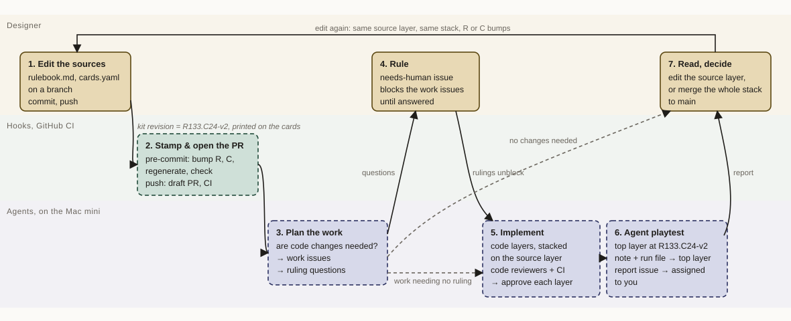

# The design loop

How a change to the sources of truth becomes code, gets playtested, and comes back to the designer. One turn of the loop is one push to a branch.

`[you]` marks the designer's rulings. `[agent-proposed]` marks details filled in by an agent and not yet ruled on. Replaces the pi game factory plan (PR #253, closed).

## The seven steps

**1. Edit the sources.** The designer, or an agent the designer directs, edits `rulebook.md` or `cards.yaml` on a branch and commits. `[you]`

**2. Stamp and open the PR.** The pre-commit hook bumps the counter for whichever source changed, regenerates the card modules and checks them. The push opens a draft PR from the branch to `main` if none is open, and CI runs `make check` and `make app-check`. `[you]` The PR is opened on push rather than at commit time because a hook runs before anything exists on GitHub. `[agent-proposed]` This branch is the *source layer*, the bottom of the loop's stack (step 5). A branch built on another open branch is a layer of that stack and gets no PR from this step. `[agent-proposed]`

**3. Review the diff.** The push starts an agent that reads what changed in the sources, since `main` on the first push and since its last review after that, and decides whether code changes are needed. It writes work issues, labelled `ready-for-agent`, and ruling questions, labelled `needs-human`, with the questions blocking the work through native issue dependencies. If no change is needed it says so on the source layer's PR. `[you]` for the trigger; issues as the output and reading only what changed since the last review `[agent-proposed]`.

**4. Rule.** A question is a `needs-human` issue assigned to the designer. Agents never claim it. The answer goes on the issue; the label swap unblocks the work. `[you]`

**5. Implement.** The loop is a gh-stack with the source layer at the bottom. Each work issue becomes a *code layer* above it, a branch with its own PR based on the layer below, so its PR shows only that issue's diff. Reviewer agents review each layer and CI checks it. A clean layer is approved, not merged: nothing reaches `main` until step 7. Agents report status as PR and issue comments. `[you]`

- A change goes in the layer that owns it. The designer owns the source layer, and every source edit goes there. Each work issue owns its code layer: a bug found later in that code is fixed on that layer, and work a source edit drops is reverted on that layer. After a commit to a lower layer, `gh stack rebase --upstack` carries it into the layers above. `[agent-proposed]`
- Agents never rewrite a commit once it is pushed: no amend, squash or force-push, except the rebase `gh stack rebase` does to carry a lower layer's change upward. A pushed commit may already be named by a kit revision, a review or a comment marker, and v counts commits, so a rewrite could give a different engine a kit revision already used. This holds on every layer, the playtest's commits and an agent's source edits included. `[you]`
- Independent work issues still stack one above the other, because a stack is linear. The runner takes one job per stack at a time, so this costs no parallelism. `[agent-proposed]`

**6. Agent playtest.** Runs on the top layer once every code layer is approved, source-blind, through `bin/nvu play`. The note and run file commit to the top layer. A report issue assigned to the designer carries the summary and links to the note. `[you]` The playtest runs inside the stack, before merge, with one report issue per stack and one comment per run, each naming the top layer's kit revision. A bug the playtest finds becomes a work issue for the layer that owns the code. `[agent-proposed]`

**7. Read, decide.** The designer reads the report and either edits the sources again on the source layer, which bumps R or C and runs the loop again inside the same stack, or merges the whole stack to `main` with `gh stack merge <top PR> --merge`. `[you]` It merges with merge commits, never a squash, so `main` shows the kit revision the playtest named: v skips merge commits, but a squashed layer would count as one commit. Squash merging is disabled on `main`. `[you]`

## Kit revision

A kit revision names one playable state of the game: `R133.C24-v2`. It replaces the `0.2.x` rules version printed on the cards. `[you]`

- **R** counts rulebook changes and **C** counts card list changes. Both are stored in the file they count, the `Rules version` line in `rulebook.md` and a line under `meta` in `cards.yaml`, and bumped by the pre-commit hook on every commit that touches the file, so each turn of the loop is playtested under its own kit revision. `[you]` The new value is one more than the higher of the last commit's and `main`'s, which is also how two branches that both reach R133 are resolved at merge. `[agent-proposed]` Where they live `[agent-proposed]`.
- **v** counts engine changes so two playtests of the same R and C on different engine builds can be told apart. It never counts merge commits. `[you]` It is derived from git, not stored: v1 is the engine as it stood when R or C last changed, and each later non-merge commit touching `app/`, excluding the generated card module, adds one. A source edit on the source layer replays the code layers after it, so on the top layer v counts all of their commits again rather than starting over at v1. `[agent-proposed]`
- One script prints the full kit revision. The CLI, the run file and the playtest note stamp what it prints. The web build bakes it in at build time. `[agent-proposed]`
- The printable kit is named by R and C alone, `R133.C24`, because nothing printed depends on the engine. The cards and the card sheet's pages carry it. `[agent-proposed]` The PDFs, the card sheet with its backs and the rulebook, are created on a merge to `main` that changes what goes into the kit, on the self-hosted runner so every kit's PDFs come from the same machine. `[you]` They are published as a GitHub release named `kit-R133.C24`. A run started by hand on a branch creates that branch's kit as a run artifact instead. `[agent-proposed]`

## Where it runs

Deterministic CI runs on GitHub-hosted runners. Agents run as jobs on a self-hosted GitHub Actions runner on the designer's always-on desktop Mac, installed as a launchd service. `[you]`

The repo is public, so a self-hosted runner is reachable from forks. Fork PR workflows require approval for all external contributors, and every `runs-on: self-hosted` job checks that its event came from this repo and not a fork, for example `github.event.pull_request.head.repo.full_name == github.repository`. `[you]`

Three identities write to the repo. `[you]`

- `nvu-bot`, a GitHub App, writes from workflows that run no agent, such as `source-pr.yml` opening the draft PR. It has Pull requests read/write, Contents read and Metadata read.
- `nvu-agent`, a GitHub App, writes from Claude jobs on the self-hosted runner: review issues, code layers and playtest reports. It has Contents, Issues and Pull requests read/write, Actions read and Metadata read, and no Workflows write.
- The designer writes as themselves.

Both apps are installed only on this repo and have their webhook off. Each job mints a token from its app with `actions/create-github-app-token`, using the variables `NVU_BOT_APP_ID` and `NVU_AGENT_APP_ID` and the secrets `NVU_BOT_PRIVATE_KEY` and `NVU_AGENT_PRIVATE_KEY`. There is no fallback to `GITHUB_TOKEN`, because a write made with it starts no other workflow: a job whose app is not configured fails. `[you]`

The contract that keeps the runner replaceable: every step starts on a GitHub event and ends in GitHub writes, meaning comments, labels, issues, PRs and commits. Nothing downstream reads the runner's own state. Claude Code Routines on a webhook, or a controller, could take the runner's place without changing the loop. `[agent-proposed]`

What GitHub provides, so nothing is built for it: dispatch by `push`, `pull_request` and `issues.labeled` events; one worker at a time by a concurrency group per stack; the workflow run as the record of an attempt, with the agent transcript uploaded as a run artifact; cancel and re-run for recovery; a marker in posted comments so a retry does not post twice. `[agent-proposed]`

## Build order

Close the loop with the designer in the middle first, then take the designer out of the parts agents can do. `[agent-proposed]`

1. Step 2: the R and C counters printed on the cards, the engine count, a workflow that opens the source layer's draft PR on push, the runner.
2. Step 3: the review agent, writing issues.
3. Step 6: the playtest as a job, with the report issue. The loop now closes end to end, with step 5 done by hand through `/take-issue`.
4. Step 5: code layers in a stack, reviewer agents, the stack merged as one.

## Not in this loop

Physical playtest kits, publication, numerical balance reports and a workbench are not part of the loop and are not blocked by it. They attach to a kit revision when they exist.
