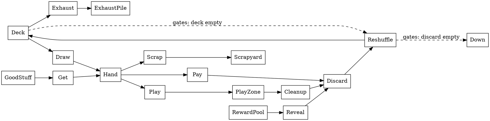

# 02 — A mechanic graph for North vs Up: how we would build one

Unticketed exploration, requested directly. The ask `[you, 2026-09-30]`: a graph of how every
mechanic in the game connects to every other, researched before anything is drawn. The
research is [01-mechanic-graph-survey.md](01-mechanic-graph-survey.md). This note applies it
to North vs Up and stops short of building anything.

**Evaluated against.** Rules 0.2.5, card list `92f010507388` (`cards.yaml` updated
2026-09-23), engine at commit `2a01755`. This note will be re-read as the game changes, so
any later evaluation should state its own triple at the top and say what moved.

**Provenance.** The ask is yours. Everything below the heading "What the survey settles" is
agent-proposed unless tagged otherwise. Facts about the game come from the rulebook and the
engine at the versions above; facts about other people's methods come from the survey and
carry its tags. Nothing here is decided. The last section lists what you would need to rule
on.

## What the survey settles

Five points from the survey shape everything that follows.

1. **A graph of mechanics is a graph, not a topology.** In mathematics a topology is a
   structure of open sets on a space [MW] [EOM]. What we want is a network: nodes and typed
   edges. The loose sense of "topology" is the network-engineering one [CISCO]. The name is
   yours to pick; this note says "mechanic graph".
2. **Almost nobody puts a mechanic at both ends of an edge.** Machinations, Bura's nets and
   LUDOCORE put a resource or a state on one end of every edge, so a rule-to-rule link is a
   two-hop path through a pool [MACH-DOC] [BURA-06] [LUDO-10]. Only the gameplay design
   patterns wiki (edges asserted by hand) and Ceptre's condensed trace (edges counted from
   runs) link mechanic directly to mechanic [GDP-WIKI] [CEPT-15]. So the first design choice
   is whether resources are nodes or hidden inside edges.
3. **The edge vocabulary is four verbs.** Across every source the edges reduce to *feeds*,
   *gates*, *modifies* and *conflicts*, under different names [survey, Synthesis]. Feedback is
   never a node; it is a cycle over those edges, found by running the system or by
   strongly-connected-component detection [DORM-09] [CEPT-15] [NX].
4. **Hand-drawn graphs are legible and sparse; derived graphs are complete and noisy.** No
   source does both and checks one against the other [survey, Synthesis]. We can, because
   the engine is code.
5. **A static graph is the Mechanics layer only.** Loops, tempo and runaway states are
   Dynamics and exist only when the mechanics run together [MDA-04]. A drawn graph names
   candidate interactions; only runs show which ones happen.

## Why this game is unusually easy to graph

The engine already has the shape every derived approach needs. From the inventory of the
repo (taken 2026-09-30):

- **State is a fixed set of named pools.** `GameState` has per-player deck, hand, discard,
  exhaust and reward pool; shared floor deck, rooms pile, Good Stuff, Bad Stuff and
  scrapyard; the play zone; and a per-turn record of counters (free plays, discount, pool
  bonus and penalty, banked Scramble). These are Machinations pools, already enumerated.
- **Movement is a vocabulary of about nineteen verbs** in `app/src/domain/verbs.ts`: draw
  one, discard from hand, exhaust from deck, scrap, shuffle into deck, take from a pile,
  move to hand, go Down, earn and give Good Stuff, deal Bad Stuff, and a few more. Each verb
  moves cards between a small number of pools. These are Bura's transitions [BURA-06].
- **Cards are hand-coded behaviours that compose those verbs.** The registry exposes eleven
  hooks (`exhaustX`, `stats`, `cost`, `freeIf`, `onPlay`, `whileHeld`, `onEvent`,
  `onChoice`, `onCleanup`, `onPlayEnd`, `onTurnStart`) and `whileHeld` carries six named
  modifiers. Which verbs, hooks and events a card touches can be read off its code. That is
  the Smiths' stimulus scheme: cards listen for events, cards emit verbs, and the card-to-
  card interactions fall out of the bipartite structure without anyone enumerating them
  [SMITH-04].
- **The engine emits a typed event stream**, about thirty event kinds, and the playtest
  files under `design/playtests/` are seed-plus-command logs that replay to that stream.
  Ceptre's condensed causal graph is built from exactly this kind of trace [CEPT-15].

So three of the four layers below can be generated, and only one has to be drawn.

## The proposed shape: one drawn layer, three derived

Each layer answers a different question. They share one node vocabulary so they can be laid
over each other.

### Layer A. The rules graph (drawn by hand)

The game as the rulebook states it, about thirty-five nodes. Three node kinds:

- **Pools**: the zones above, plus the team stat pool (Oomph and Scramble), the floor
  counter, and the per-turn counters.
- **Transitions**: the phase steps, by name. Flip, Draw, Play (pay, play, add up stats),
  Outcome (Clear, Flee), Cleanup, Ascend (shuffle hand in, reveal a reward, rebuild the
  floor), and the keyword verbs (Exhaust, Scrap, Get Good Stuff, Get Bad Stuff, Peek).
- **Terminals**: Down, Win.

Four edge kinds, taking the survey's vocabulary and Machinations' shapes [MACH-DOC]:

| Edge | Meaning | Example |
|---|---|---|
| feeds | a transition moves cards from one pool to another | Draw: deck → hand |
| gates | a pool's state decides whether a transition may fire | stat pool ≥ threshold gates Clear; empty deck and empty discard gates Down |
| modifies | a pool's state changes the rate or label of another edge | held Sluggish raises Cost; Faceful lowers the draw target |
| triggers | a transition fires another | Flee triggers reshuffling the room into the floor deck; Ascend triggers Reveal a card reward |

Bura's constraint, that edges run only pool-to-transition or transition-to-pool and never
pool-to-pool, keeps the drawing honest [BURA-06]. The whole card economy fits in a dozen
pools. Sketched in DOT, the Stamina cycle alone is:

That picture already shows the game's one negative feedback loop in Dormans' sense
[DORM-09]: playing costs cards, cost drains the deck, a drained deck reshuffles, and Exhaust
and Scrap leak cards out of the cycle for good. Everything else in the game modifies the
rate of one of those edges.

### Layer B. The verb graph (derived from the engine)

For each verb in `verbs.ts` and each phase handler in `engine.ts`: which state fields it
reads and which it writes. The inventory already lists this per handler. It can be
regenerated by a script using ts-morph, which walks the compiler's syntax tree and can find
every reference to a symbol [TSM], or more cheaply by grep over the property names, since
the state type is small and stable.

This layer's job is to check Layer A. Every drawn "feeds" edge should have a verb behind it;
every verb should appear on some drawn edge. A verb with no drawn edge is either a rule the
rulebook forgot or code the game no longer needs.

### Layer C. The card graph (derived from the registry and cards.yaml)

A bipartite graph: card on one side, mechanic on the other. A card is joined to every
hook it declares, every verb it calls, every event it listens for, every pending choice it
raises, and every keyword its printed text uses. Rooms join to their outcome effect types
(exhaust from deck, deal Bad Stuff, take Good Stuff, reveal reward, scrap Bad Stuff) and to
the stats their thresholds print.

Two projections come for free [NX]:

- **Mechanic to mechanic, weighted by how many cards join them.** This is the closest thing
  to "how every mechanic connects to every other" in the ask, and it is Ludii's concept
  co-occurrence applied to one game instead of a thousand [LUDII-23]. A heavy edge is a
  synergy the deck keeps reaching for; a zero edge is an untried pairing.
- **Card to card, weighted by shared mechanics.** Cards that sit alone are orthogonal in the
  Smiths' sense [SMITH-03]; a tight cluster is a family.

The inventory gives a first reading without any tooling: of fifty-nine non-room cards,
sixteen are plain stat lines with no behaviour, `drawOne` is called seventeen times across
the three registries, and `applyPoolBonus` is called only by Stuff.

### Layer D. The observed graph (derived from recorded runs)

Replay each file under `design/playtests/` and each sim run through the engine, and for
every turn record which events followed which. Condense by event kind. The result is
Ceptre's condensed trace graph [CEPT-15]: a directed graph whose edge weights say how often
one mechanic actually led to another in play, and whose cycles are the loops that really
turned, not the ones the rulebook permits.

Laying D over A answers the MDA objection [MDA-04]. An edge drawn in A that never carries
weight in D is a rule nobody triggers. A heavy edge in D with nothing in A is an interaction
the rulebook does not name.

## What the graph would be for

A graph built with no question in mind is a poster. The survey shows each tradition was
built to answer one thing. Candidate questions for this game, in the order I would rank
them:

1. **Which mechanics are load-bearing?** Articulation points and betweenness on Layer A
   [NX]. If the answer is "Cost and Exhaust", the design already knows that; if a keyword
   nobody thinks about turns up, that is news.
2. **What does a new card touch?** Its row in Layer C, before it is written. This is the
   question a designer asks most often and the one the graph answers most cheaply.
3. **Where are the loops, and do they turn?** Strongly connected components on A, then
   weights from D. Dormans' seven loop characteristics need a runnable model, and the sim
   is one [DORM-09].
4. **Is anything orphaned?** Hooks declared and used by no card, keywords with no card,
   effect types with no room. The inventory found some already (below).
5. **Do the cards spread across the mechanics or clump?** The card-to-card projection of
   Layer C. This is the orthogonality check [SMITH-03].

## Things the inventory turned up on the way

These fell out of reading the engine against the rulebook. They are candidate issues, not
filed, and not part of the graph work.

- The Play-phase alternation rule sits under the Cleanup heading in the rulebook
  (lines 107 to 109).
- The engine does not enforce alternation. There is no pass command; `END_PLAY` ends the
  phase for both.
- A comment in `printed.ts` says Ascend clears "instead of running Cleanup". The rulebook
  and the engine both run Cleanup first.
- `Threshold.fleeFree` exists in the printed-card types with no rulebook entry and no card.
- Three registry hooks are declared and unused: `cost()`, and the held modifiers
  `ignoresExhaustX` and `playedPowerDelta`.

## How it would be built, if built

Small and generated, matching how the card sheet is made.

- **Every graph is stamped with the version it was read from** `[you, 2026-09-30]`. The
  same triple the playtest export writes: rules version from `setup.ts`, `CARD_LIST_ID`
  from the generated card list, and the engine commit. It goes in the YAML's `meta` block
  and in a comment at the top of every emitted DOT file, so two graphs taken at different
  points can be diffed and a stale one is visible at a glance. A graph whose stamp does not
  match the current rules and cards fails the check below, the way a stale
  `cards.generated.ts` does.
- **Layer A lives as data, not as a picture.** One YAML edge list under `design/`, with
  `from`, `to`, `kind` and a one-line `rule` citation, so it is diffable and every edge can
  be traced to a rulebook line. A picture is emitted from it.
- **One script under `tools/`** reads that YAML, the registries, `cards.yaml` and the
  playtest logs, and emits one Graphviz DOT file per layer plus a merged one [DOT]. Graphviz
  because it is the one notation every other tool imports and exports, and because the
  drawings are for reading, not for interaction.
- **Measures on demand**, not in the repo: a few dozen nodes need no library, and for
  centrality and components NetworkX's functions are the reference implementations [NX].
- **A check, like `make check` for cards**: every verb appears on a drawn edge; every card
  with text has at least one Layer C edge; every drawn edge kind is one of the four.

Total: one YAML file, one script, one Makefile target. The rulebook and the engine stay the
sources of truth; the graph is a reading of them.

## What the graph cannot do

- It cannot say whether the game is fun, balanced, or too hard. That is Aesthetics and
  Dynamics [MDA-04]; the playtests answer those.
- It cannot see space or sequence inside a turn. Machinations has the same blind spot
  [ADAMS-12].
- Layer C sees only what the registry code names. A card whose whole effect is a stat line
  connects to nothing but the stat pool, which is correct and uninformative.
- It cannot rank loops by strength without runs. Weight comes from Layer D or from a
  Machinations-style simulation, not from the drawing.

## Rulings needed

- What to call it.
- Which of the five questions it should answer first.
- Whether Layer A is drawn from the rulebook alone or from the engine where they differ.
- Whether Layer D is in scope for a first version.
